# Virtu Capital 管理员端操作指南

> **文档版本**：v1.0  
> **适用对象**：系统管理员、超级管理员、运营人员、风控人员
> **最后更新**：2026年6月

---

## 目录

1. [系统登录与基础设置](##1-系统登录与基础设置)
2. [仪表盘概览](##2-仪表盘概览)
3. [投资者管理](#3-投资者管理)
4. [股票管理](#4-股票管理)
5. [市场数据管理](#5-市场数据管理)
6. [记录审核](#6-记录审核)
7. [审计日志](#7-审计日志)
8. [系统设定](#8-系统设定)
9. [消息模板管理](#9-消息模板管理)
10. [用户反馈处理](##10-用户反馈处理)
11. [常见问题 FAQ](#11-常见问题-faq)

---
## 0. 如何成为管理员
> 1️⃣在**Virtu Capital客户端**使用香港手机号注册为**投资者**，绑定自定义的邮箱如：name@virtucapital.com和密码（当前邮箱不需要注册和验证，后续添加验证）
> 2️⃣由管理员账号将投资者角色更改为管理员；
> 3️⃣由后端技术人员将投资者角色更改为超级管理员。

## 1. 系统登录与基础设置

### 1.1 登录系统

**操作路径**：访问管理员端网址 → 输入账号密码 → 点击登录

| 步骤 | 操作说明 |
|------|---------|
| 1 | 在浏览器中打开 Virtu Capital [管理员端地址](https://app.virtu-capital.com/zh-Hant/admin/users) |
| 2 | 输入**邮件账号**（如 admin@virtucapital.com） |
| 3 | 输入**密码** |
| 4 | 点击「登录」按钮 |

> ⚠️ **安全提示**：首次登录后请立即修改初始密码，建议开启双因素认证（2FA）。


### 1.2 登录后界面

登录成功后，页面左下角显示：
- **管理员名称**：当前登录账号的显示名称
- **登出按钮**：点击可安全退出系统

| 1 | 可选择切换**语言**（支持English/繁体中文/简体中文） |
|---|---|
| 2 | 可选择切换**主题**（Dark / Light 模式） | |

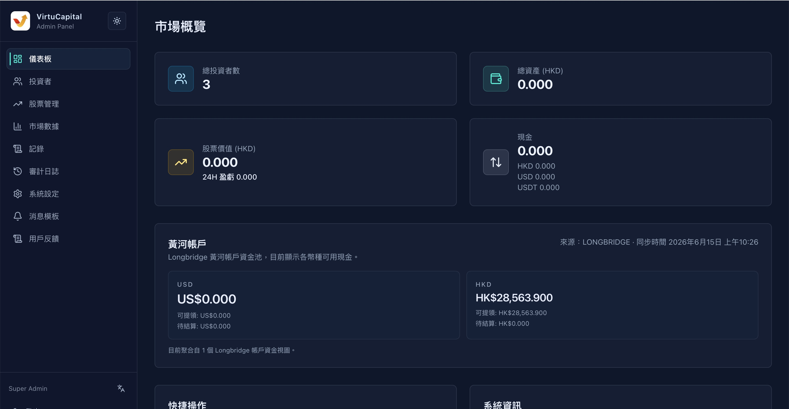
---

## 2. 仪表盘概览

仪表盘是管理员登录后的默认首页，提供平台核心数据的**实时监控**。

### 2.1 市场概览卡片

| 指标 | 说明 |
|------|------|
| **总投资者数** | 平台注册投资者的总人数 |
| **总资产（HKD）** | 所有投资者资产的总和（按当前汇率折算为港币） |
| **股票价值（HKD）** | 所有投资者持有股票的市值总和 |
| ├─ W/L 24小时盈亏 | 最近24小时内股票市值的盈亏变化 |
| **现金** | 各币种的现金余额汇总 |
| ├─ HKD | 港币现金余额 |
| ├─ USD | 美元现金余额 |
| └─ USDT | USDT 余额 |

> 💡 **用途**：快速掌握平台整体资产规模和资金分布情况。
> 


### 2.2 黄河账户

显示平台自有资金的账户余额：
- **美元余额**
- **港元余额**

> ⚠️ **注意**：黄河账户用于平台资金调配，操作需谨慎。

### 2.3 快捷操作

提供三个常用功能的快速入口：
1. **管理投资者** → 跳转至投资者列表页
2. **管理股票分配** → 跳转至股票管理页
3. **查看市场** → 跳转至市场数据页

### 2.4 系统信息

| 项目 | 说明 |
|------|------|
| 应用程序 | 系统名称（Virtu Capital） |
| 版本 | 当前系统版本号 |
| 环境 | 运行环境（生产环境/测试环境） |

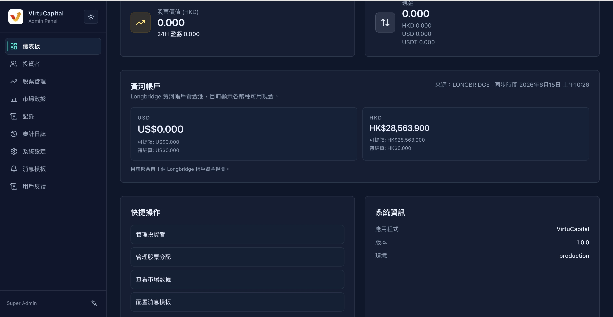

---

## 3. 投资者管理

### 3.1 投资者列表

**操作路径**：左侧导航栏 → 「投资者」

#### 检索功能

支持多维度检索投资者：
- **手机号**：输入完整或部分手机号
- **姓名**：输入投资者姓名
- **电子邮件**：输入注册邮箱

> 🔍 **技巧**：支持模糊搜索，输入部分信息即可匹配。

#### 表格字段说明

| 字段 | 说明 |
|------|------|
| **姓名** | 投资者真实姓名 |
| **手机号** | 注册手机号 |
| **电子邮件** | 注册邮箱地址 |
| **总资产** | 该投资者的股票市值 + 现金余额 |
| **成本** | 该投资者的历史投入成本 |
| **盈亏** | 累计盈亏金额及涨跌幅百分比 |
| **今日盈亏** | 当日盈亏金额及涨跌幅百分比 |
| **角色** | 用户权限级别 |
| **操作** | 可执行的管理操作 |

#### 角色类型

| 角色 | 权限范围 |
|------|---------|
| **投资者** | 普通用户，可进行交易、查看持仓等 |
| **管理员** | 可管理投资者、审核记录、查看数据 |
| **超级管理员** | 拥有全部权限，包括系统设定、角色变更等 |

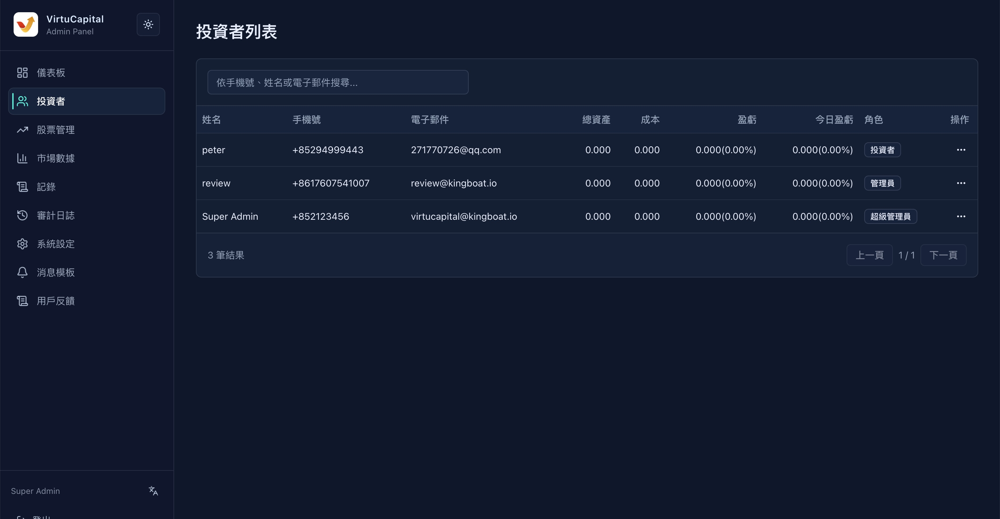

### 3.2 投资者操作

点击「操作」列的按钮，可执行以下操作：

#### 查看详情
- 查看该投资者的完整资料
- 包括：个人信息、持仓明细、交易记录、资金流水等

#### 编辑用户
- 修改投资者的基本信息（姓名、联系方式等）
- 修改投资者的账户设置

#### 变更角色
- 将投资者升级为管理员
- 将管理员降级为投资者
- **超级管理员**才能执行此操作

> ⚠️ **风险提示**：变更角色前请确认用户身份，避免权限滥用。

#### 删除用户
- 永久删除该投资者账户
- **此操作不可逆**，删除前系统会要求二次确认
- 建议先导出该用户数据备份
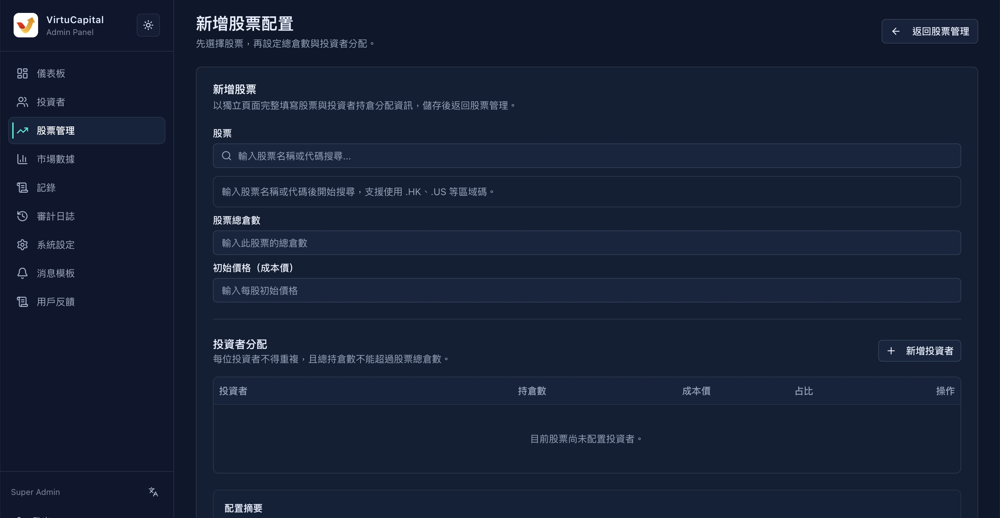

---

## 4. 股票管理

### 4.1 黄河账户持仓概览

**操作路径**：左侧导航栏 → 「股票管理」

顶部展示平台整体持仓情况：

| 指标 | 说明 |
|------|------|
| **持仓股票数** | 平台管理的股票种类数量 |
| **黄河账户总持仓** | 平台自有账户的总持仓市值 |
| **可分配持仓数** | 尚未分配给投资者的持仓数量 |
| **已分配持仓数** | 已分配给投资者的持仓数量 |
| **超分配股票** | 已分配数量超过总仓数的股票（风险指标） |
| **已管理股票数** | 当前正在管理的股票总数 |
| **总设定仓数** | 所有股票设定的总持仓数量 |
| **已分配仓数** | 已分配给投资者的仓数总和 |
| **涉及投资者** | 持有股票的投资者人数 |

> 🚨 **重点关注**：「超分配股票」表示分配异常，需立即核查。
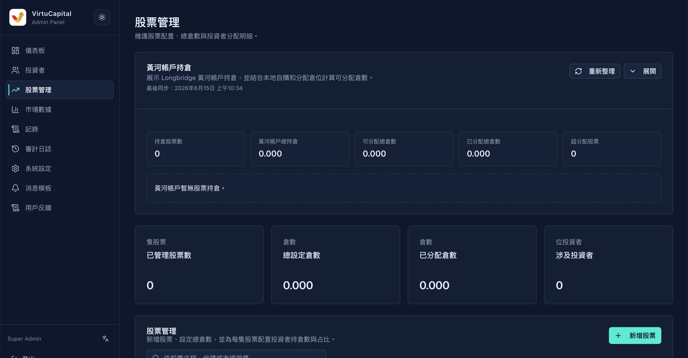


### 4.2 股票管理列表

#### 检索功能

| 检索条件 | 说明 |
|---------|------|
| **股票名称** | 输入股票中文/英文名称 |
| **股票代码** | 输入股票代码（如 00700） |
| **市场搜索** | 按市场筛选（港股/美股/A股） |

#### 表格字段说明

| 字段 | 说明 |
|------|------|
| **股票** | 股票名称 |
| **市场** | 所属市场（港股HK/美股US/A股CN） |
| **总仓数** | 该股票设定的总持仓数量 |
| **已分配仓数** | 已分配给投资者的持仓数量 |
| **剩余仓数** | 总仓数 - 已分配仓数 |
| **投资者数** | 持有该股票的投资者人数 |
| **建立时间** | 该股票加入系统的时间 |
| **操作** | 编辑/删除等操作 |

### 4.3 新增股票

**操作路径**：股票管理页 → 点击「新增股票」按钮


#### 步骤一：配置股票信息

| 字段 | 说明 | 必填 |
|------|------|------|
| **股票** | 搜索并选择股票（支持名称/代码搜索） | ✅ |
| **股票总仓数** | 设定该股票的总持仓数量 | ✅ |
| **初始价格（成本价）** | 该股票的初始成本价格 | ✅ |

#### 步骤二：投资者分配

为投资者分配持仓：

| 字段 | 说明 |
|------|------|
| **投资者** | 选择要分配的投资者 |
| **持仓数** | 分配给该投资者的持仓数量 |
| **成本价** | 该投资者的持仓成本价 |
| **占比** | 该投资者持仓占总仓数的比例（自动计算） |
| **操作** | 删除该分配行 |

> 💡 **提示**：可添加多行，为多个投资者同时分配。

#### 步骤三：配置摘要

系统自动计算并展示：
- **股票总仓数**：设定的总持仓数
- **已分配仓数**：当前已分配的持仓总数
- **剩余仓数**：总仓数 - 已分配仓数

> ⚠️ **校验规则**：已分配仓数不能超过总仓数。


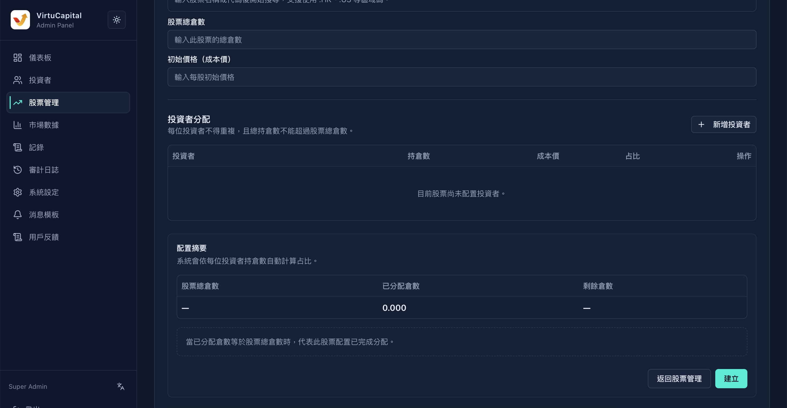

---
## 5. 市场数据管理

### 5.1 汇率快照

**操作路径**：左侧导航栏 → 「市场数据」→「汇率快照」

#### 汇率列表

| 字段 | 说明 |
|------|------|
| **来源** | 汇率数据来源 |
| **汇率日期** | 当前汇率的生效日期 |
| **市场汇率｜固定汇率** | 切换汇率类型 |
| ├─ 自动刷新 | 系统自动从市场获取最新汇率 |
| └─ 人工编辑 | 管理员手动输入汇率（需提交审核） |

#### 支持的汇率对

| 汇率对 | 说明 |
|--------|------|
| 1 HKD → USD | 港币兑美元 |
| 1 USD → HKD | 美元兑港币 |
| 1 HKD → USDT | 港币兑USDT |
| 1 USD → USDT | 美元兑USDT |
| 1 USDT → HKD | USDT兑港币 |
| 1 USDT → USD | USDT兑美元 |

> ⚠️ **审核要求**：人工编辑的汇率需要提交审核，审核通过后生效。

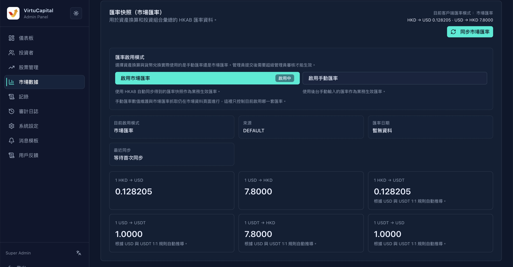
#### 编辑汇率操作步骤

1. 在对应汇率行点击「编辑」
2. 输入新的汇率数值
3. 点击「提交审核」
4. 等待超级管理员审核通过
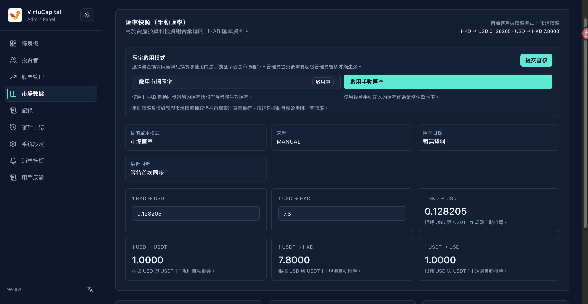

### 5.2 股市数据

显示各市场的数据同步状态：

#### 港股市场信息

| 字段 | 示例值 | 说明 |
|------|--------|------|
| **交易所** | 1 | 交易所数量 |
| **股票** | 3,106 | 已同步的股票数量 |
| **指数** | 4 | 已同步的指数数量 |
| **上次同步** | 2026年5月25日 晚上7:53 | 最近一次同步时间 |
| **耗时** | 4.0s | 上次同步耗时 |
| **触发来源** | api | 同步触发方式 |
| **下次计划** | 2026年5月25日 晚上8:00 | 下次自动同步时间 |
| **计划识别码** | 2026-05-24 | 同步任务标识 |

#### 支持的市场

- **中国A股**
- **港股**
- **美股**

> 💡 **说明**：股市数据通常由系统自动同步，管理员一般无需手动干预。如遇数据异常，可联系技术团队处理。

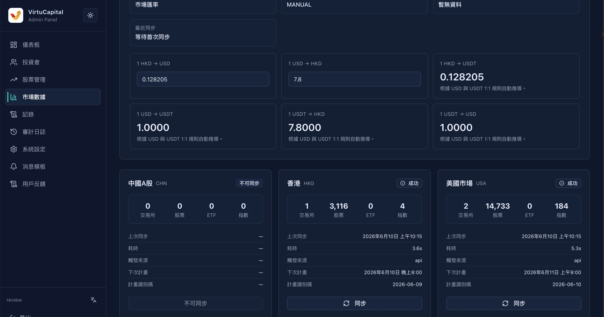
---

## 6. 记录审核

**操作路径**：左侧导航栏 → 「记录」

> 🔔 **红点提示**：当有「待审核」记录时，菜单会显示红点提醒。

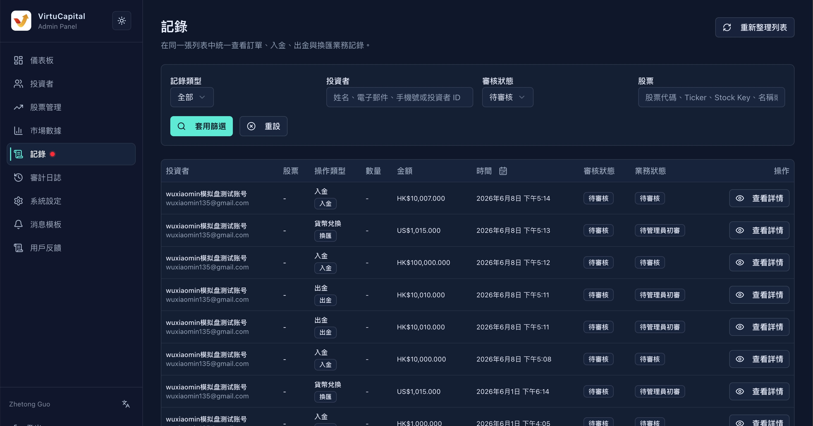
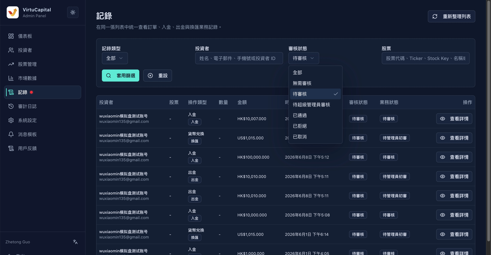


### 6.1 检索功能

支持多维度组合筛选：

#### 记录类型

| 类型 | 说明 |
|------|------|
| **全部** | 显示所有类型的记录 |
| **订单** | 股票买入/卖出订单 |
| **入金** | 投资者充值记录 |
| **出金** | 投资者提现记录 |
| **换汇** | 币种兑换记录 |
| **转仓** | 转仓记录 |
| **后台操作** | 管理员在后台执行的操作记录 |

#### 投资者筛选

| 条件 | 说明 |
|------|------|
| **姓名** | 投资者姓名 |
| **电子邮件** | 注册邮箱 |
| **手机号** | 注册手机号 |
| **投资者ID** | 系统分配的唯一ID |
#### 审核状态筛选

| 条件 | 说明 |
|------|------|
| **无需审核** | 不需要管理员审核的记录如订单 |
| **待审核** | 需要管理员审核的记录如出入金 |
| **待超级管理员审核** | 需要超管理员审核的操作如出金 |
| **已通过** | 审核已通过 |
| **已拒绝** | 审核已拒绝 |
| **已取消** | 投资者取消了原操作 |

#### 股票筛选

| 条件 | 说明 |
|------|------|
| **股票代码** | 如 00700 |
| **Ticker** | 股票交易代码 |
| **Stock Key** | 系统内部标识 |
| **名称** | 股票名称 |
| **订单号** | 具体订单编号 |

#### 其他筛选条件【暂定】

| 条件 | 说明 |
|------|------|
| **日期** | 按日期范围筛选（接日期筛选组件） |
| **审核状态** | 无需审核 / 待审核 / 待超级管理员审核 / 审核通过 / 审核拒绝 |
| **业务状态** | 已提交 / 已撤销 / 管理员已通过 / 超级管理员已通过 / 已拒绝 / 已入账 / 已打款 |

> 💡 **操作**：设置好条件后，点击「套用筛选」执行搜索，点击「重设」清空条件。

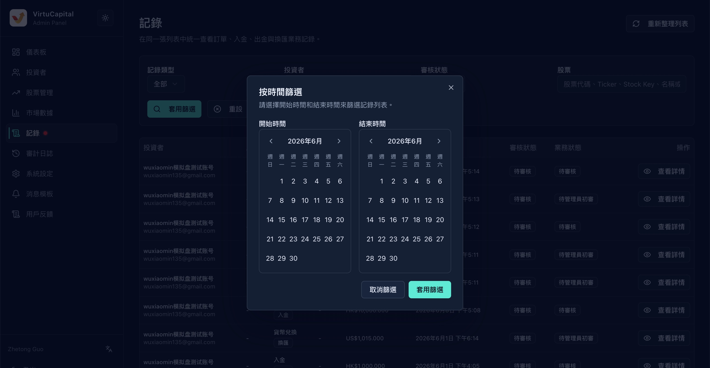

### 6.2 表格结构

| 字段 | 说明 |
|------|------|
| **投资者** | 提交该记录的投资者 |
| **股票** | 涉及的股票（如适用） |
| **操作类型** | 入金 / 出金 / 转入 / 转出 / 转让 / 资料变更 / 用户删除 |
| **数量** | 交易数量（如适用） |
| **金额** | 涉及金额 |
| **时间** | 记录提交时间 |
| **审核状态** | 当前审核进度 |
| **业务状态** | 业务处理进度 |
| **查看详情** | 查看完整信息并执行审核操作 |

### 6.3 各类型记录详情与审核

#### 入金记录审核

**入金详细字段**：

| 字段 | 示例值 | 说明 |
|------|--------|------|
| **入金单号** | 6a159…… | 系统生成的唯一单号 |
| **使用者** | mi | 投资者账号 |
| **入金方式** | 本地（香港）汇款 / 国际汇款 | 资金转入方式 |
| **入金币种** | HKD | 充值币种 |
| **金额** | HK$100,000.00 | 充值金额 |
| **手续费** | HK$0.00 | 扣除的手续费 |
| **总额** | HK$100,000.00 | 实际到账金额 |
| **入金时间** | 2026年5月26日 晚上9:07 | 用户提交时间 |
| **审核状态** | 已通过 | 审核进度 |
| **资金状态** | 已入账 | 资金到账状态 |
| **审核时间** | 2026年5月26日 下午3:03 | 管理员审核时间 |
| **入账时间** | 2026年5月26日 下午3:03 | 资金实际入账时间 |

**入金凭证**：
- 查看投资者上传的转账截图/凭证

**审核操作**：

| 操作 | 说明 |
|------|------|
| **审核通过** | 确认入金有效，资金入账 |
| **拒绝原因** | 如拒绝，需填写拒绝原因 |
| **拒绝申请** | 确认拒绝该入金申请 |

**关联入账流水**：
入账流水关联账户：黄河（暂定，后续是否改为VC独立的银行账户？）

| 字段 | 说明 |
|------|------|
| **流水ID** | 系统生成的流水号 |
| **状态** | 成功 / 失败 / 处理中 |
| **币种** | 流水币种 |
| **金额** | 流水金额 |
| **入账前余额** | 入账前账户余额 |
| **入账后余额** | 入账后账户余额 |

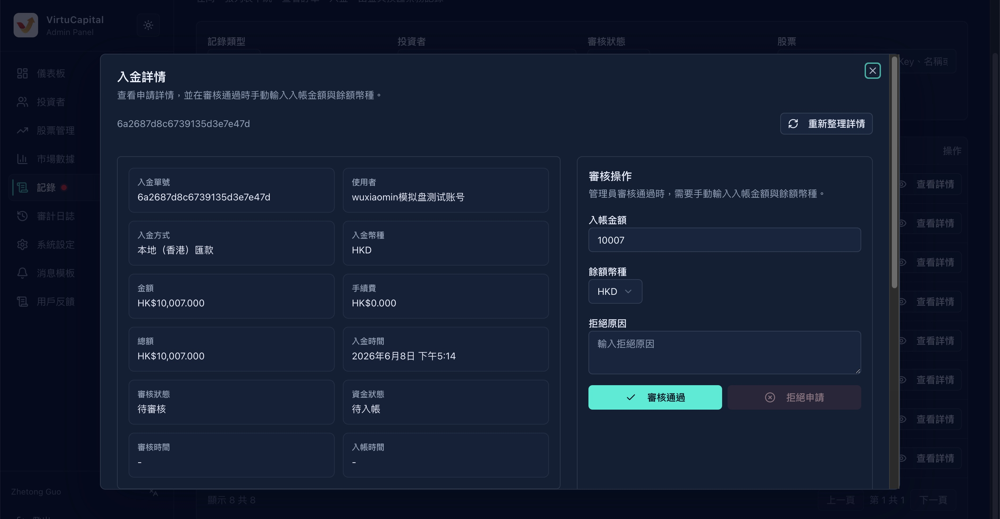
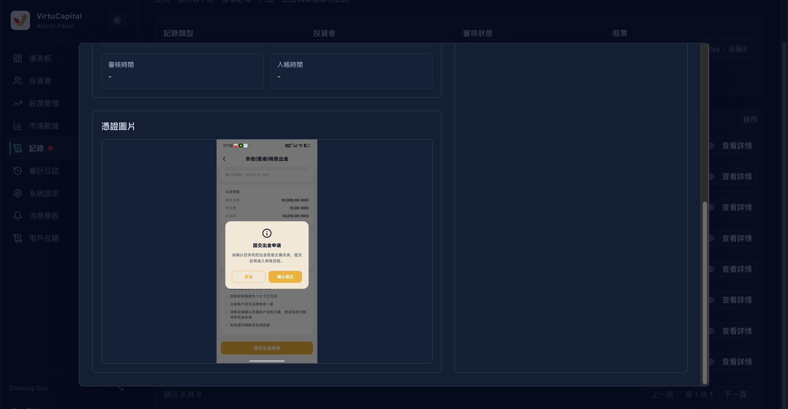


#### 出金记录审核

审核流程与入金类似，重点关注：
- 出金账户余额是否充足
- 出金账户信息是否正确
- 手续费计算是否准确
- **并且，管理员审核通过后，需要超级管理员二次审核**

#### 买入/卖出/转入/转出/转让/订单

- 检查投资者持仓/资金是否充足，手续费和价格是否合理
- 确认市场是否开放交易
- **并且，转仓需要管理员审核、超级管理员二次审核**

#### 资料变更审核

- 核对变更前后的信息
- 确认变更申请人为本人
- 涉及敏感信息（如银行卡）需额外验证

#### 用户删除审核

- 确认该用户无未结清资产
- 确认删除原因合理
- **此操作不可逆**，需特别谨慎

### 6.4 审核状态流转

```
已提交
  ├── 已撤销（用户主动取消）
  ├── 待审核 → 管理员已通过 → 超级管理员已通过 → 已入账/已打款
  │              ├── 已拒绝（管理员拒绝）
  │              └── 待超级管理员审核
  │                         ├── 超级管理员已通过
  │                         └── 已拒绝（超级管理员拒绝）
  └── 无需审核（系统自动处理）
```

### 6.5 批量审核操作

在记录列表页：
1. 勾选多条记录（复选框）
2. 点击「批量审核通过」或「批量拒绝」
3. 确认操作

> ⚠️ **注意**：批量操作前请仔细核对记录内容，避免误操作。

---

## 7. 审计日志

**操作路径**：左侧导航栏 → 「审计日志」

审计日志记录所有管理员的操作行为，用于安全审计和问题追溯。
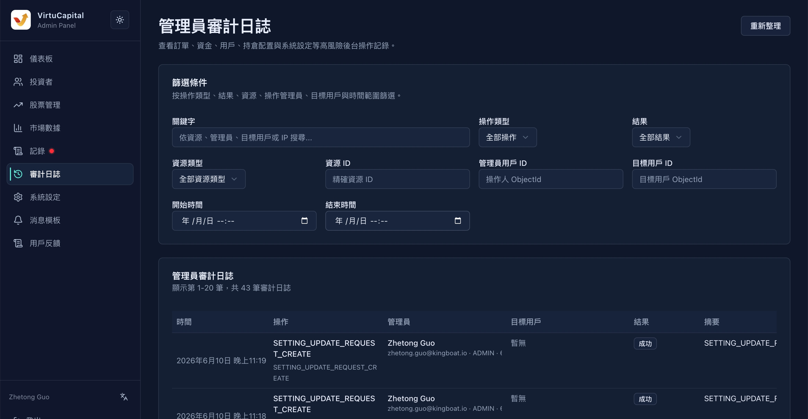

### 7.1 筛选条件

| 条件 | 说明 |
|------|------|
| **关键字** | 搜索操作内容中的关键词 |
| **操作类型** | 创建 / 修改 / 删除 / 审核 等 |
| **结果** | 成功 / 失败 |
| **资源类型** | 用户 / 股票 / 订单 / 配置 等 |
| **资源ID** | 具体资源的唯一标识 |
| **管理员用户ID** | 执行操作的管理员 |
| **目标用户ID** | 被操作影响的用户 |
| **开始时间** | 筛选时间范围起点 |
| **结束时间** | 筛选时间范围终点 |

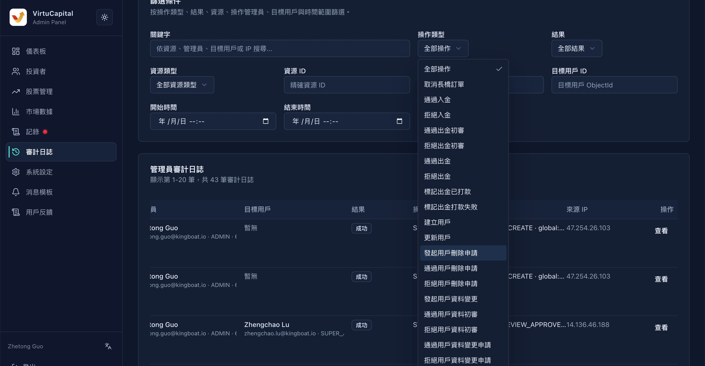

### 7.2 日志表格

| 字段 | 说明 |
|------|------|
| **时间** | 操作执行时间 |
| **操作** | 具体操作描述 |
| **管理员** | 执行操作的管理员账号 |
| **目标用户** | 被操作影响的用户（如适用） |
| **结果** | 操作是否成功 |
| **摘要** | 操作内容的简要说明 |

> 💡 **用途**：当出现问题时，可通过审计日志追溯是谁、在何时、做了什么操作。

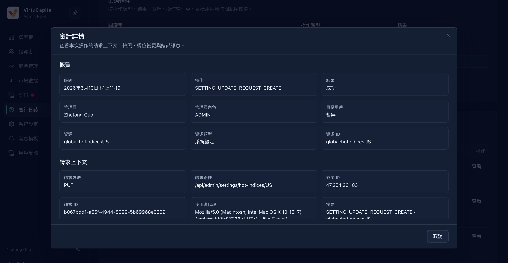

---

## 8. 系统设定

**操作路径**：左侧导航栏 → 「系统设定」

> ⚠️ **重要提示**：系统设定的所有修改都需要**提交审核**，审核通过后才会生效。

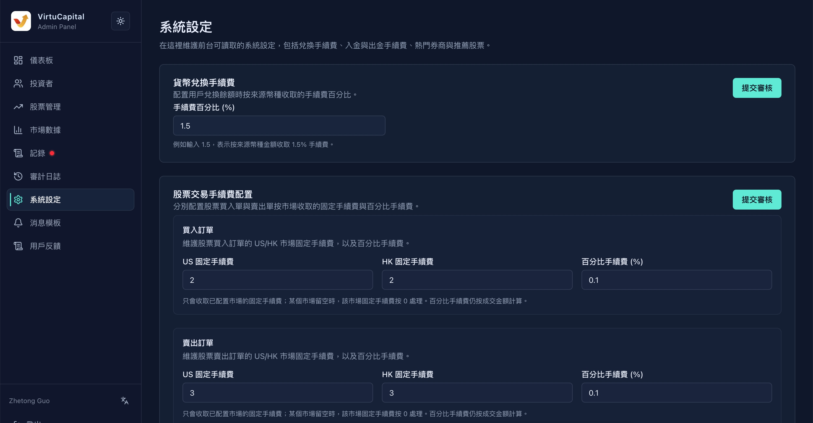


### 8.1 货币兑换手续费

| 字段 | 说明 |
|------|------|
| **手续费百分比** | 币种兑换时收取的手续费比例 |

**操作步骤**：
1. 输入新的手续费百分比
2. 点击「提交审核」
3. 等待超级管理员审核

### 8.2 股票交易手续费

#### 买入订单手续费

| 字段 | 说明 |
|------|------|
| **US固定手续费** | 美股买入的固定手续费金额 |
| **HK固定手续费** | 港股买入的固定手续费金额 |
| **百分比手续费** | 按交易金额百分比收取的手续费 |

#### 卖出订单手续费

| 字段 | 说明 |
|------|------|
| **US固定手续费** | 美股卖出的固定手续费金额 |
| **HK固定手续费** | 港股卖出的固定手续费金额 |
| **百分比手续费** | 按交易金额百分比收取的手续费 |

> 💡 **计算规则**：实际手续费 = max(固定手续费, 交易金额 × 百分比手续费)

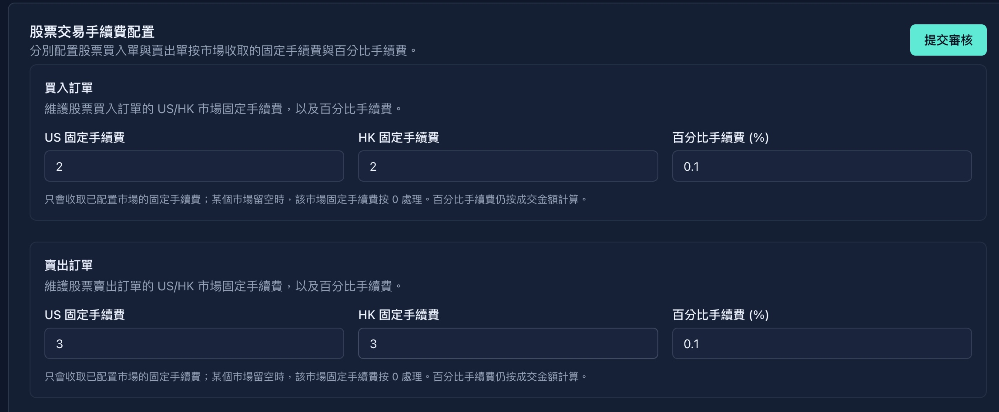


### 8.3 入金配置

#### 国际电汇

| 字段 | 说明 | 示例 |
|------|------|------|
| **收款银行** | 收款银行名称 | HSBC Hong Kong |
| **SWIFT代码** | 银行SWIFT代码 | HSBCHKHHXXX |
| **账户名称** | 收款账户名 | Virtu Capital Limited |
| **账户号码** | 收款账号 | 123-456789-001 |
| **手续费百分比** | 入金手续费比例 | 0% |
| **银行地址** | 收款银行地址 | 1 Queen's Road Central, HK |

#### 本地（香港）汇款

| 字段 | 说明 |
|------|------|
| **银行代码** | 香港银行代码（3位数字） |
| **分行代码** | 分行代码（3位数字） |
| **账户名称** | 收款账户名 |
| **账户号码** | 收款账号 |
| **FPS转数快识别码** | FPS识别码（支持快速转账） |
| **手续费百分比** | 入金手续费比例 |

#### USDT

| 字段 | 说明 |
|------|------|
| **手续费百分比** | USDT入金手续费比例 |

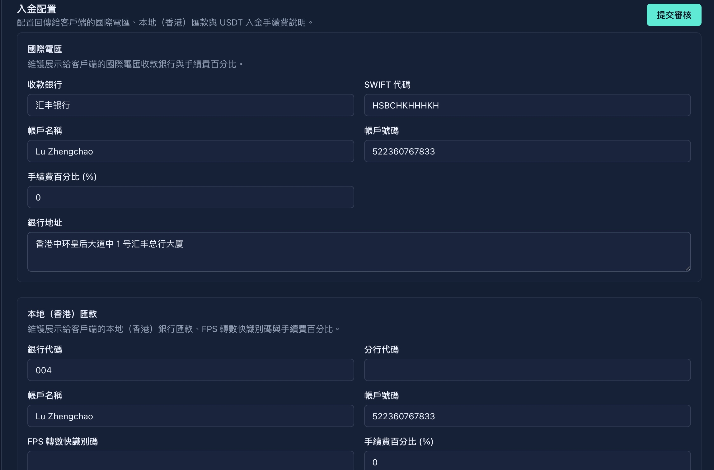
### 8.4 出金配置

| 出金方式 | 配置项 | 说明 |
|---------|--------|------|
| **国际电汇** | 手续费占比 | 提现金额的手续费比例 |
| **本地（香港）转账** | 手续费占比 | 本地转账的手续费比例 |
| **USDT** | 手续费占比 | USDT提现的手续费比例 |

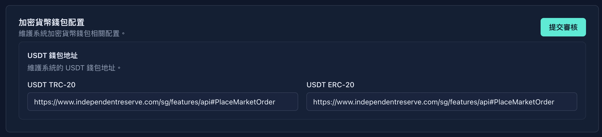

### 8.5 加密货币钱包配置

| 钱包类型 | 说明 |
|---------|------|
| **USDT TRC-20** | 波场链USDT钱包地址配置 |
| **USDT ERC-20** | 以太坊链USDT钱包地址配置 |

> ⚠️ **安全警告**：钱包地址配置错误可能导致资金永久丢失，请仔细核对。

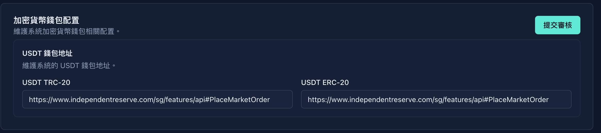

### 8.6 开户协议配置

配置投资者开户时所需阅读和同意的协议如client agreement。


### 8.7 热门指数配置

配置APP市场页展示股票市场指数的列表。
例如港股的恒生指数
例如美股的纳斯达克指数
**操作步骤**：
1. 选择要配置的市场
2. 搜索并添加推荐指数
3. 调整展示顺序（拖拽排序）
4. 点击「提交审核」


### 8.7 推荐券商和股票推荐配置（暂不展示）

| 配置项 | 说明 |
|--------|------|
| **港股推荐配置** | 市场展示的港股推荐列表 |
| **美股推荐配置** | 市场展示的美股推荐列表 |
| **沪深股票推荐配置** | 市场展示的A股推荐列表 |

**操作步骤**：
1. 选择要配置的市场
2. 搜索并添加推荐股票
3. 调整展示顺序（拖拽排序）
4. 点击「提交审核」


---

## 9. 消息模板管理

**操作路径**：左侧导航栏 → 「消息模板」

系统内置了多种业务场景的通知模板，管理员可查看和编辑模板内容。
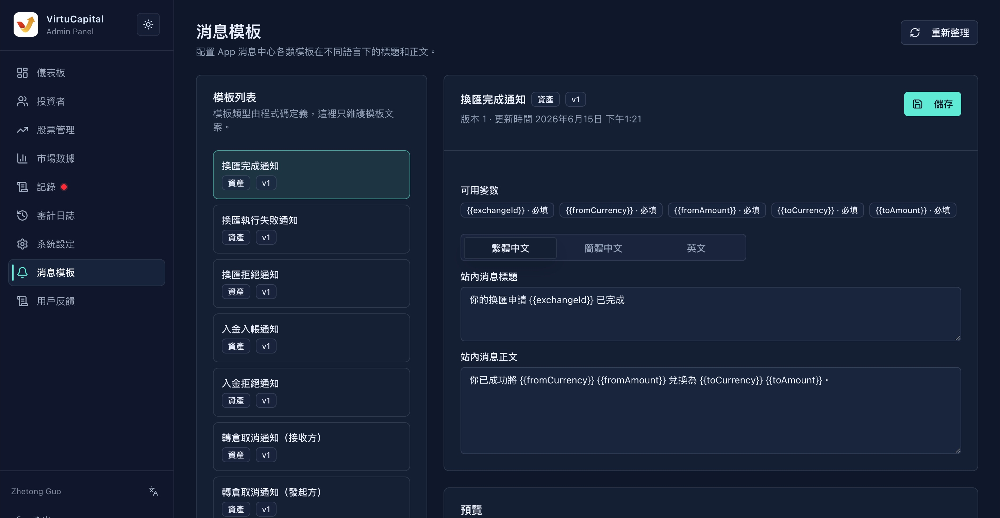

### 9.1 模板列表

| 模板名称 | 触发场景 |
|---------|---------|
| **换汇完成通知** | 币种兑换成功 |
| **换汇执行失败通知** | 币种兑换失败 |
| **换汇拒绝通知** | 币种兑换申请被拒绝 |
| **入金入账通知** | 入金审核通过并到账 |
| **入金拒绝通知** | 入金申请被拒绝 |
| **转仓取消通知（接收方）** | 股票转仓被取消（接收方） |
| **转仓取消通知（发起方）** | 股票转仓被取消（发起方） |
| **转仓完成通知（接收方）** | 股票转仓完成（接收方） |
| **转仓完成通知（发起方）** | 股票转仓完成（发起方） |
| **转仓终审拒绝通知** | 转仓申请终审被拒绝 |
| **转仓待确认通知（接收方）** | 等待接收方确认转仓 |
| **转仓初审通过通知（发起方）** | 转仓申请初审通过 |
| **转仓初审拒绝通知** | 转仓申请初审被拒绝 |
| **转仓待终审通知** | 转仓申请等待终审 |
| **转仓拒收确认（接收方）** | 接收方确认拒收 |
| **转仓拒收通知（发起方）** | 通知发起方被拒收 |
| **转仓提交通知** | 转仓申请已提交 |
| **出金通过通知** | 出金申请审核通过 |
| **出金拒绝通知** | 出金申请被拒绝 |
| **电子邮件变更提醒** | 用户修改邮箱 |
| **登入密码变更提醒** | 用户修改登录密码 |
| **交易密码变更提醒** | 用户修改交易密码 |
| **系统公告** | 平台发布公告 |
| **订单取消通知** | 交易订单被取消 |
| **订单成交通知** | 交易订单成交 |
| **订单拒绝通知** | 交易订单被拒绝 |

### 9.2 模板编辑

**操作步骤**：
1. 点击模板名称进入编辑页
2. 修改模板内容（支持变量占位符，如 `{user_name}`、`{amount}`）
3. 预览效果
4. 点击「保存」

> 💡 **变量说明**：模板中 `{变量名}` 的部分会在发送时自动替换为实际值。

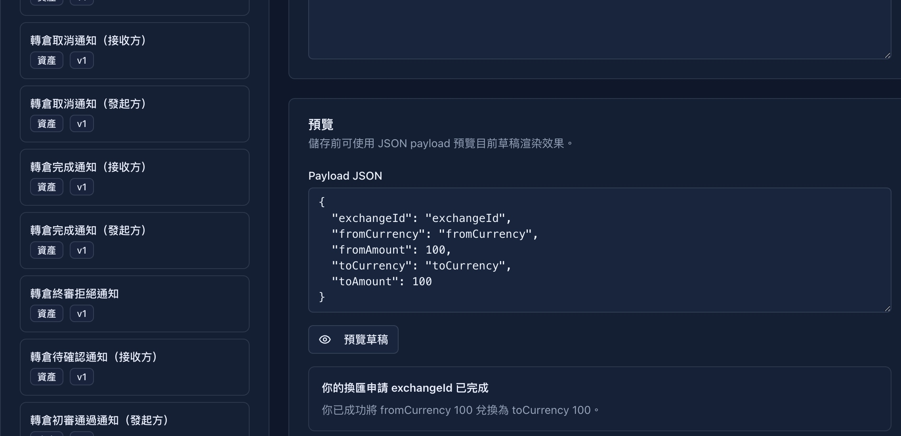

---

## 10. 用户反馈处理

**操作路径**：左侧导航栏 → 「用户反馈」


### 10.1 反馈列表

| 字段 | 说明 |
|------|------|
| **用户名称** | 提交反馈的投资者 |
| **反馈类型** | 业务反馈 / 产品反馈 |
| **反馈内容** | 用户填写的具体反馈文字 |
| **图片** | 用户上传的截图（如有） |
| **提交时间** | 反馈提交时间 |

### 10.2 反馈处理流程

1. **查看反馈**：点击反馈记录查看详情
2. **分类处理**：
   - **业务反馈** → 转交业务团队处理
   - **产品反馈** → 转交产品团队评估
3. **回复用户**：通过系统消息或邮件回复处理结果
4. **标记状态**：将反馈标记为「已处理」

> 💡 **建议**：定期汇总用户反馈，识别高频问题，推动产品和流程优化。

---

## 11. 常见问题 FAQ

### Q1：为什么我的审核操作没有立即生效？

**A**：系统设定和关键业务操作（如汇率修改、手续费调整）需要**提交审核**并由超级管理员审批后才能生效。请在「记录」页面查看审核进度。

### Q2：如何处理「超分配股票」？

**A**：「超分配股票」表示已分配给投资者的持仓超过了总仓数，属于异常情况。处理步骤：
1. 进入「股票管理」查看超分配详情
2. 核查各投资者的持仓数据
3. 联系相关投资者协调调整
4. 修正分配数据，确保总仓数 ≥ 已分配仓数

### Q3：投资者忘记密码怎么办？

**A**：管理员无法直接查看或修改投资者密码。请引导投资者：
1. 在登录页点击「忘记密码」
2. 通过注册邮箱或手机号重置密码
3. 如无法自助重置，可在「投资者管理」中核实身份后协助处理

### Q4：如何导出数据？

**A**：各列表页通常支持导出功能：
1. 设置好筛选条件
2. 点击「导出」按钮
3. 选择导出格式（Excel/CSV）
4. 下载文件

### Q5：系统出现异常数据怎么办？

**A**：
1. 首先查看「审计日志」，确认是否有异常操作
2. 检查「市场数据」同步状态，确认行情数据正常
3. 如无法自行解决，联系技术团队并提供：
   - 问题描述
   - 截图
   - 相关记录ID
   - 审计日志中的操作记录

### Q6：如何修改自己的管理员信息？

**A**：点击页面右上角的管理员名称，进入个人中心：
- 修改显示名称
- 修改登录密码
- 配置双因素认证（2FA）

### Q7：为什么有些记录显示「待超级管理员审核」？

**A**：以下操作需要超级管理员终审：
- 大额资金操作（超过设定阈值）
- 系统设定修改
- 角色变更
- 用户删除
- 人工编辑的汇率

普通管理员初审通过后，会自动流转到超级管理员终审。

### Q8：如何查看某个投资者的所有操作记录？

**A**：
1. 进入「投资者管理」
2. 找到该投资者，点击「查看详情」
3. 在详情页查看「交易记录」「资金流水」「操作日志」等标签页

---

## 附录

### 附录 A：审核权限对照表
#### 客户端角色权限表
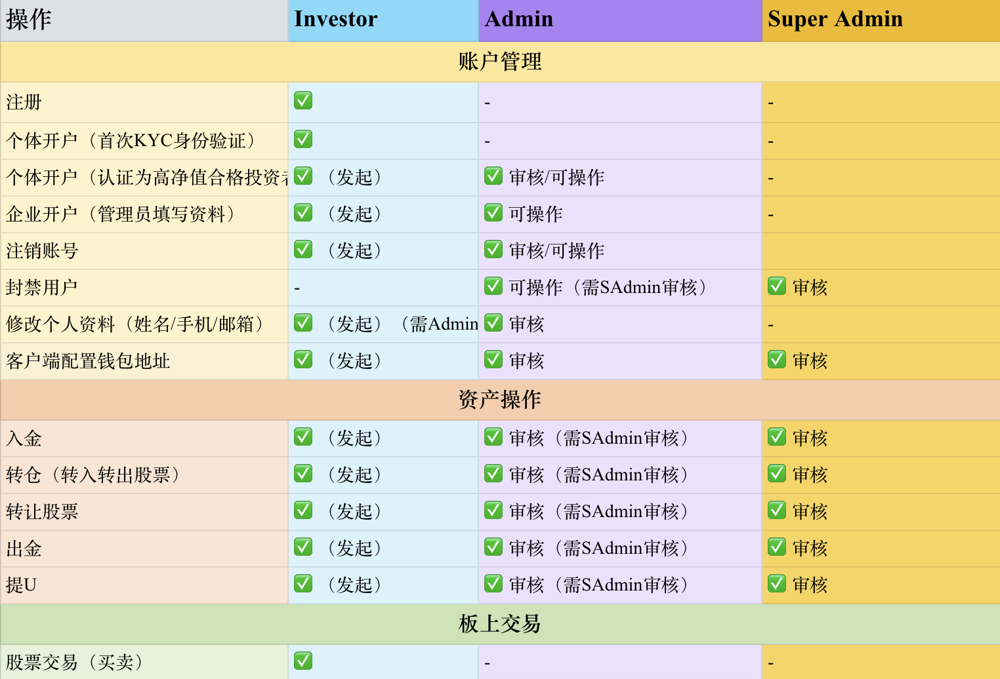

#### 管理员端角色权限表
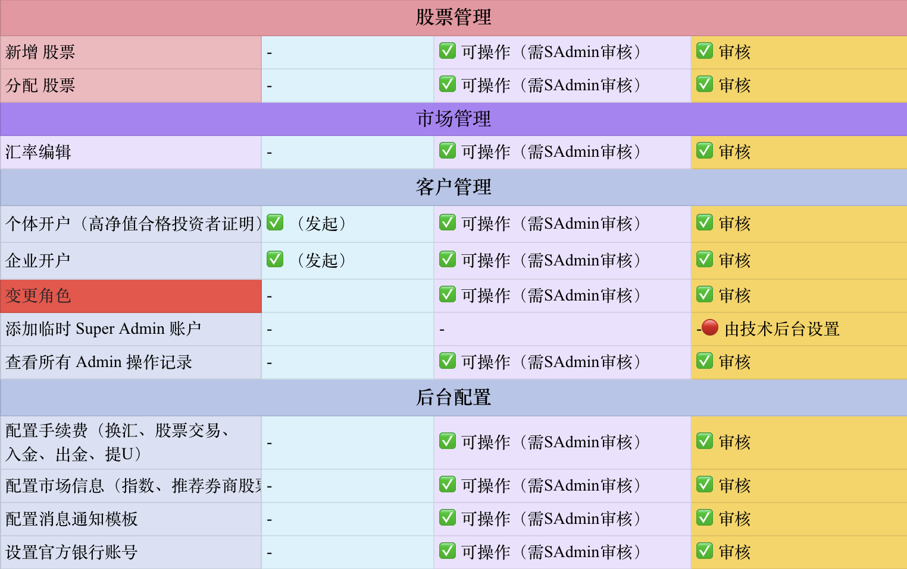

### 附录 B：联系支持

| 问题类型 | 联系方式 |
|---------|---------|
| 技术故障 | tech-support@virtucapital.com（占位） |
| 业务咨询 | operations@virtucapital.com（占位） |
| 紧急事件 | 24小时热线：+852-xxxx-xxxx（占位） |

---

> **文档结束**
>
> 如有疑问或建议，请联系技术和运营团队。
